# TeamVision: 高效的软件项目管理，协作工具

Teamvision的项目管理包含了任务、提测、Bug管理，统计分析等功能。支持多成员协作，并且深度集成了持续集成（CI）。Teamvision 支持每日构建，自动化测试，一键部署等功能。 Teamvision通过任务流功能支持流水线构建发布，正真做到高效的软件过程管理与监控。
Demo展示地址：[www.teamcat.cn](http://www.teamcat.cn)

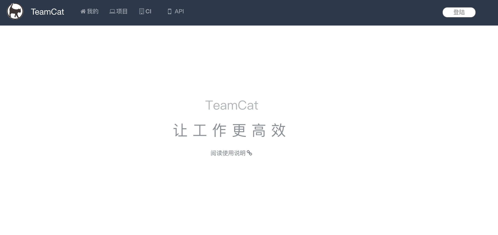


## 新版发布

最新版本0.0.3版本已经发布。全新安装可以体验。暂不支持从老版本升级。
更新功能如下：
  + 1  任务看板添加【过滤分析功能】
  + 2  任务增加【甘特图浏览模式】
  + 3  优化问题界面，在详情面板增加【移动端扫码传附件】功能
  + 4  优化提测，任务看板样式
  + 5  修复部分bug

## Installation

### 之后我们提供的偶数版本为稳定版本，奇数版本为测试版本，请下载安装的同学注意。

Teamvision安装部署部分在distribute文件夹中，采用组件分步部署方式：

### 分步部署：
#### 要求：CentOs7  python3.5
#### TeamVision组件依赖：
mongo,redis,nginx,mysql,python
在build_shell文件夹下面已提供各个组件的安装脚本，注：nginx与python3.5必须安装脚本安装，其他供参考。
#### python安装要求：
需py3.5版本，用ditribute/0.0.1/python/python.sh脚本安装。
#### mongo安装要求：
需3.4版本以上，不能添加密码，安装后能够启动成功，并且在安装teamcat的机器能够访问。
##### 注：（因不同人在不同环境，包括执行目录等等因素，可能导致脚本中的相关路径有微弱差异，请自行修改，提供的安装脚本只是为大家方便，仅作参考）
#### redis安装要求：
需3.2版本以上，安装后能够启动成功，并且在安装teamcat的机器能够访问。
#### nginx安装要求：
需1.12.0版本以上，因涉及到nginx.conf文件配置，必须用ditribute/0.0.1/build_shell/nginx/nginx.sh脚本安装。
##### 注：（因不同人在不同环境，包括执行目录等等因素，可能导致脚本中的相关路径有微弱差异，请自行修改，提供的安装脚本只是为大家方便，仅作参考）
#### mysql安装要求：
需5.6，5.7版本，安装后能能够启动成功，确保能够登录，并且在安装teamcat的机器能够访问。
将ditribute/0.0.1/build_shell/mysql 下面的team_vision.sql与privileges.sql导入到mysql。
##### 注：（之前我们遇到很多同学是因ip限制,ip端口不通等因素无法连接数据库，导致登录报用户名不存在，项目不存在等等一些列问题，后续的同学请注意一下）
#### Teamvision 启动
首先在机器上创建/web/www 目录，将ditribute/0.0.1/build_shell下面的 teamvision与dist 拷贝到/web/www/下面。
打开/web/www/teamvision/teamvision/settings.py，修改配置文件。

将部署的机器地址添加到allow_host，如图所示

将安装的mongo信息添加到mongo配置，如图所示
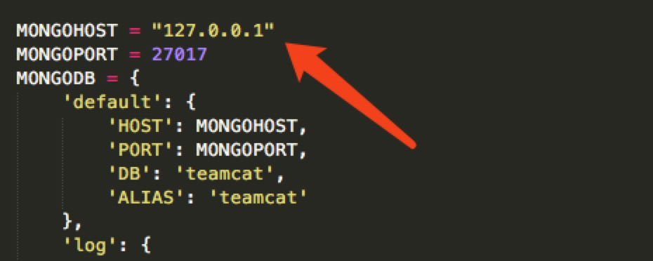
将安装的redis信息添加到redis配置，如图所示
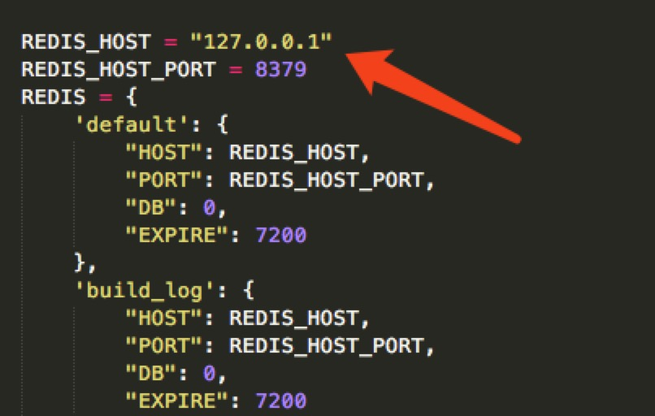
将安装的mysql信息添加到mysql配置，如图所示
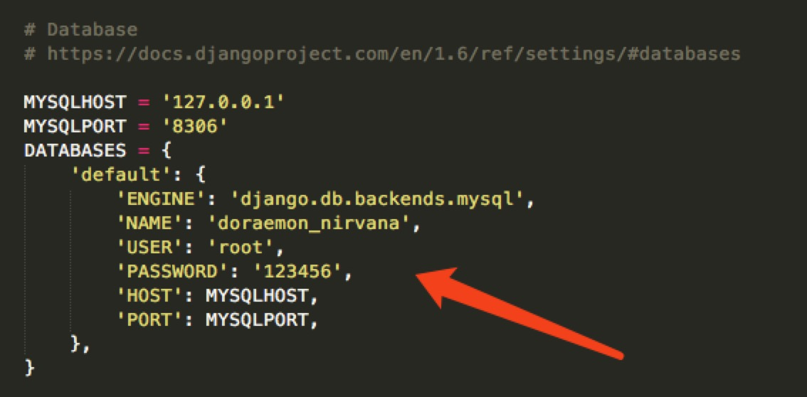
将邮件服务器信息添加到email配置，如图所示
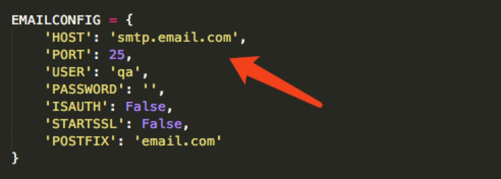
将webhost改成你部署后访问teamcat的地址，例如“http://www.teamcat.cn”
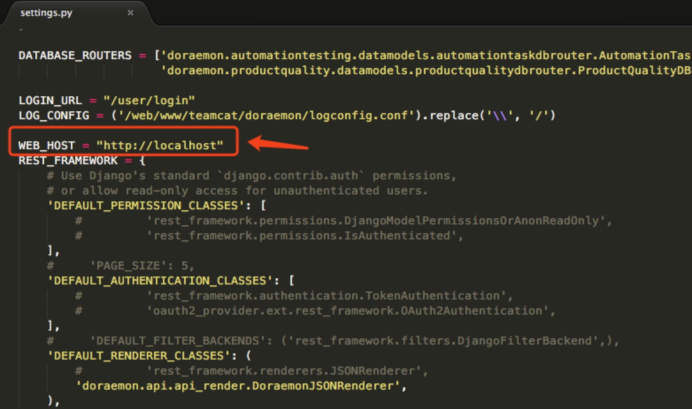
将teamcat.sh脚本加上执行权限，root权限下执行
   执行teamvision.sh
   
   ```sh
   $ ./teamvision.sh
   ```

## Quick Start

   安装成功后，输入目标机器地址，端口8848，例如http://127.0.0.1:8848/ 访问teamvision
   
### 注：目前teamvision只支持chrome浏览器，初始登录账号：teamcat@teamcat.cn 密码：123456  用此账号登录后可自由添加账号。

### 项目
1. 添加首个自己的项目
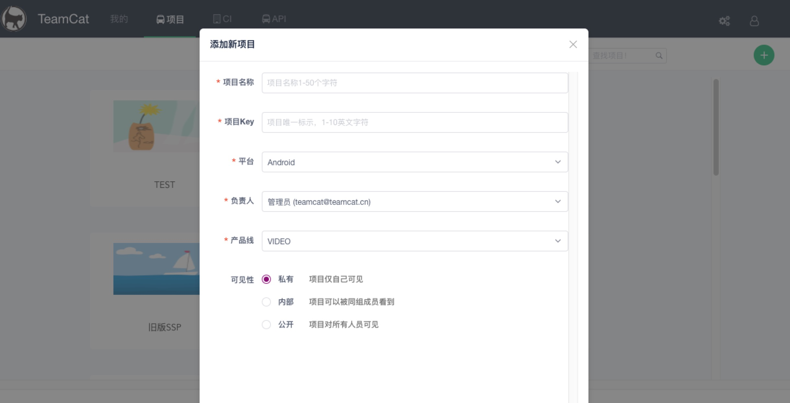
2. 进入到项目就可以使用问题，提测，任务，统计，归档等功能。
### CI:
   CI部分功能使用需要部署Controller与Agent，Controller具有监听、调度、下发任务等功能，Agent负责在所需的不同机器上执行具体构建任务，简要架构如下：
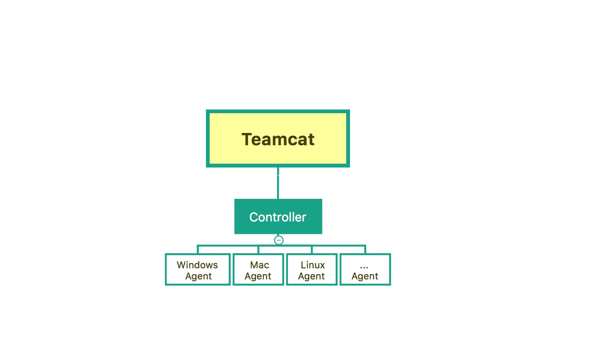
1. 部署准备
   
     1.1. 首先进入CI-设置，添加一个Agent。添加完成后，记住AgentID，这个ID就是创建Agent成功以后列表行#号后面的数字。.这个ID需要在启动Agent的时候配置到agent.properties文件里。也就是修改agent.key.
 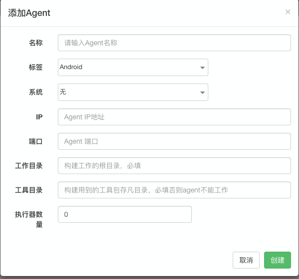
2) Redis服务器信息更新
在数据库中DicData表里找到309，310两行记录把IP地址和端口换成和前面Settings文件里一致
3) Controller启动
   
将distribute/0.0.X/目录下将conroller的zip包拷贝到目标机器（要求JDK8）上解压缩。然后修改controller.properties文件。一共两个配置项：
- INTERFACE_BASE_URL = http://10.69.58.195:8443/（***服务地址，别漏了最后的斜杠***）
- EMAIL_IS_AUTH = false （***发送邮件时需要密码的话改为true***）
**最后就是启动Controller了，命令是：controller.sh start**
4) Agent启动
   
将distribute/0.0.X/目录下的agent.zip 复制到目标目录，解压缩。修改agent.propities文件。
- agent.key= (**这里填写前面的agentid**)
- server.host= http://10.69.58.195:8443/ (**这里和前面controller配置文件里的INTERFACE_BASE_URL一致**)启动名称 直接agent.sh 就可以。如果是windows系统用agent.bat脚本就行。
5) CI构建邮件发送
我们可能在Settings文件里配置过一次邮件相关的东西了，但是CI相关邮件的发送还要再配置一次。(**后续会尽快提供系统配置功能，统一配置**）CI邮件相关的配置在数据库字典表里。请修改DicData表里：17，18，19，20行，相应的配置即可。如果要密码才能发送邮件，请参考前面controller.properties文件的配置。字典表的第26行可以配置默认的收件人，也就是无论项目成员有没有他都可以通过默认收件人配置收到邮件。

2.使用步骤：
   添加一个CI任务，设置好任务配置及构建参数即可实现每日构建，自动化测试，一键部署等功能。具体来看一下怎么配置。
    创建任务
- 任务类型
   
             - 构建任务
             -  测试任务
             -  部署任务
             -  复制任务
 创建任务相对简单，具体就不细说了。创建好任务后会看到下图。

**点击任务卡片右上角的配置图标进入任务配置页面，如下图**。
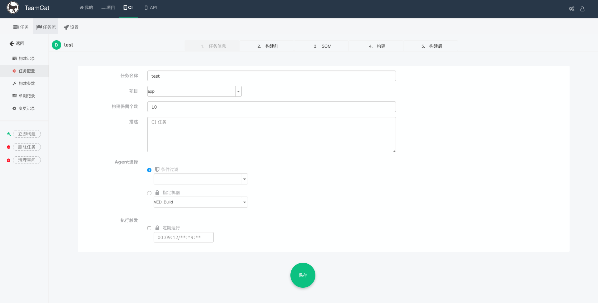
任务构成。包含以下几部分。
- 基本配置:基本配置如果使用过jenkins应该都清除，这里主要说一下定时的规则。如果你写一个具体的时间例如12：23：34分这代表每天12点23分34秒执行。如果你写12:**:**则代表每隔12小时执行一次。**:08:**则是每隔8分钟执行一次。**注意定时器是在你制定时间前后一定时间内执行，有一定时间差。**
- 构建前: 构建前操作请放到这个部分
- SCM： 代码相关操作可以放到这个部分
- 构建： 构建，部署等可以放到这个部分
- 构建后： 构建后操作部分
*** 注意上面提到的构建前，SCM，构建，构建后都是逻辑概念，并不会硬性的区分成几个阶段，后续版本可能会考虑添加成强制概念***
 任务的执行过程是由具体的步骤构成的。可以在配置页面的右上角的步骤列表里找到适用的步骤插件。步骤插件可以添加多个，通过拖动插件来改变插件的执行顺序。插件包括 代码，构建，服务端测试，WebUI测试，Android，IOS构建插件，以及shell插件等。看下表可以知道目前提供的插件以及功能。

名称|功能|依赖
-|:-:|-:
SVN| SVN代码管理插件| 无
GIT|代码管理插件| 无
Shell 命令行|执行Shell命令或者批处理| 无
命令行构建|命令行构建，并上传构建包| 无
Gradle构建|Gradle构建插件| 无
IOS构建|IOS构建插件| 无
Ant构建|Ant构建插件| 无
SSH文件替换| 通过SSH替换文件| 无
SSH部署| 远程通过SSH部署| 无
IOS命令行构建| 命令行构建IOS包| 无
Copy to Server| 复制产物或其他包到服务器| 无
接口测试| API接口测试插件|需要依赖GAT框架
XCode配置检查| 对XCODE项目做项目配置检查| 无
XCTest测试|已经过期| 无
Selenium| WebUI自动化插件|依赖GAT| 无

*上述提供的插件在配置完成后，如果暂时不用可以选择Disable，对于Disable的插件在执行过程中将不会被执行。*

**重点提示: 请在配置完插件后做点击保存。从不同的构建阶段切换时，如果不保存，配置将会丢失**

**重点提示: 请在配置完插件后做点击保存。从不同的构建阶段切换时，如果不保存，配置将会丢失**

**重点提示: 请在配置完插件后做点击保存。从不同的构建阶段切换时，如果不保存，配置将会丢失**

以上就是如何配置一个简单的任务。接下来说一下CI默认提供的全局变量。大家可以在CI--设置进去就可以看到。

名称|用法|说明
-|:-:|-:
WORKSPACE|${WORKSPACE}|代表当前任务在Agent上的工作目录
BUILDTOOL|${BUILDTOOL}|Agent上的构建工具目录
BUILDVERSION|${BUILDVERSION}|代表当前任务的构建版本，根据构建次数自增
COMMONSPACE|${COMMONSPACE}|各构建任务可以共享的一个目录
BUILDBACKUPSPACE|${BUILDBACKUPSPACE}|根据构建版本自动创建的目录，不会随任务执行清除
TASKID|${TASKID}|构建任务ID
TASKNAME|${TASKNAME}|构建任务名称
HISTORYID|${HISTORYID}|构建任务记录ID,使用记录相关API获取上传package下载URL

**全局变量可以用在步骤插件的任意位置使用**

看完了全局变量，我们再来说一说Teamvision CI提供的另外一项功能 ***【构建参数】*** 点击任务卡片可以进入查看。如下图：
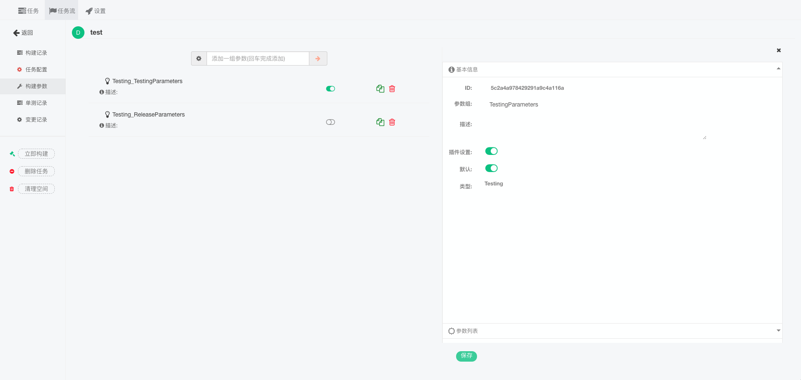

按照提示输入参数组的名称回车即可创建一个构建参数。构建参数包含三个部分。
   
+ 基本信息： 这部分展示参数局基本信息
+ 参数列表： 这里是用来定义Key-Value形式参数的地方
+ 插件列表： 这个部分可以通过参数化的方式定义任务的执行步骤是否执行
上图我们看到图的右半部分就是基本信息。除了像ID，名称，描述信息之外还有两个信息比较重要，下面做重点介绍。
   
+ 插件设置： 选中这个设置表示在任务执行过程中，将启用你在插件列表中对于执行步骤的状态定义（on/off）
+ 默认设置:    参数组是否作为默认参数组，在你执行任务时不选中任何参数组时使用。

有了以上的基本介绍，我们来看看参数列表的使用。如下图：


参数列表是以Key-Value形式存在。再使用的时候可以在配置任务时通过${key}的形式使用。例如要使用图上所示的值：${AndroidVersion}就可以了。
**重点提示：创建完成参数组以后记得保存。**

说完了参数列表，我们在来看看插件列表里有什么。先请看图：
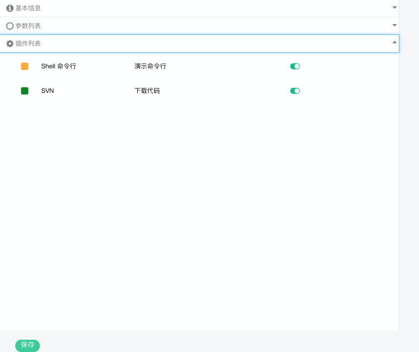

如果你的插件列表里看不到插件或者插件看到的不一样，这是任务配置的时候使用的步骤插件不一样而已。
当我们看到这个列表，我们就可以通过右侧的开关来决定这个插件是否在执行过程中被启用。
**重点提示： 如果你改变了插件的活动状态，请记得保存。**

***最后整体说一下参数组的功能： 参数组其实是把构建用到参数做了一个配置化的操作。把你经常使用的参数按照参数组的形式保存，下次使用时直接选用就可以。同时我们的构建过程有时候需要些特殊场景，例如有些构建产物需要执行单元测试，有些场景不需要。那我们就可以使用不同的参数组来定制，而不是创建两个任务。这时候我们构建参数的插件列表功能就派上用场了，你可以在不同的参数组里定制那些步骤插件会被执行。默认情况下，插件设置（前面在介绍基本信息的时候提到了）是不会打开的，也就是说任务执行时按照你在任务配置界面的配置来执行。只有你在构建参数基本信息页面打开了【插件设置】后，才会生效。***
      

## Q&A
### Question:
如果我想部署的目标机器已经存在mongo,redis,nginx,mysql等基础组件，不想重新安装这些可以直接启动TeamCat服务吗？

### Answer:
当然可以啦，但是首先目标机器需要创建/web/www/目录，并将distribute文件夹下的teamcat文件夹拷贝到此目录，打开teamcat/doraemon/settings.py文件，将其中的ALLOWED_HOSTS，MYSQLHOST，MONGOHOST，REDIS_HOST分别配置成已有环境的地址，并且EMAILCONFIG中的邮件服务器必须具有发邮件的权限才能正常发送构建通知邮件。如果不想创建此目录，需将settings.py文件中所有配置为/web/www/目录的地方改成teamcat实际所在目录的地址。

## More

如果大家有更多的问题或改进想法，欢迎访问我们的demo地址[www.teamcat.cn](http://www.teamcat.cn)，通过里面的联系方式与我们多多沟通交流。

